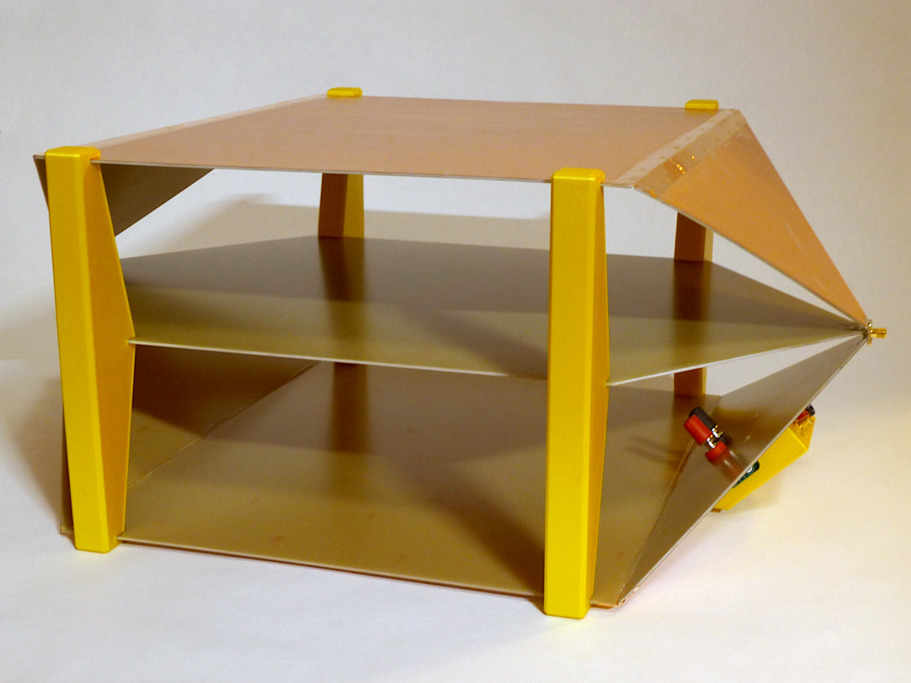
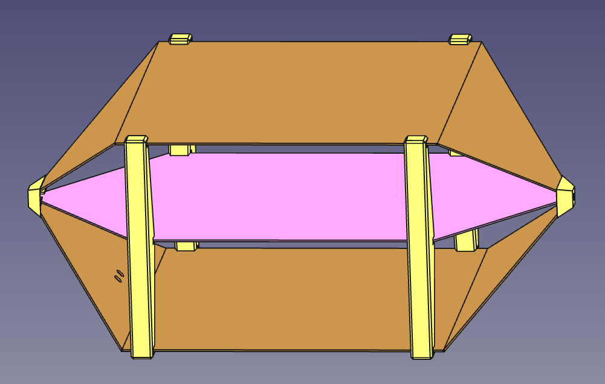
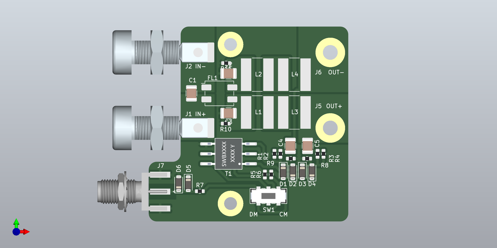
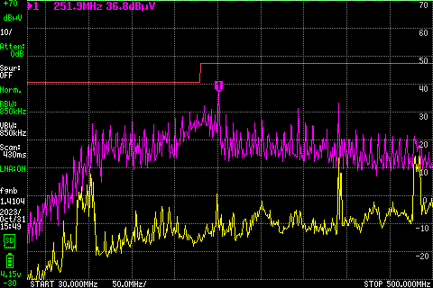

# Custom built TEM cell for EMC measurements

This repository contains FreeCAD and KiCad design files for a [TEM cell](https://en.wikipedia.org/wiki/TEM_cell)
with integrated [LISN](https://en.wikipedia.org/wiki/Line_Impedance_Stabilization_Network).

When combined with a spectrum analyzer, it can be used for EMC pretest measurements.

More construction details are available in [my blog article](http://essentialscrap.com/tem_cell/).

## TEM cell structure

The TEM cell consists of three conductive layers: shield on the top and bottom, and septum in the middle.
The width and spacing of the conductors determines the [characteristic impedance](https://en.wikipedia.org/wiki/Characteristic_impedance) of the transmission line.
The default dimensions are designed for an impedance of 50 ohms, matching most measurement equipment.

Any non-magnetic metal can be used for the construction.
The default thickness of 1.6 mm is set for commonly available PCB material.

Coaxial connectors are mounted at each end of the cell.
In normal operation one end is terminated with a 50 ohm resistor
and the other end is connected to spectrum analyzer or signal generator.

## Dimensions

The classic source for custom TEM cell builds is [Do-it-Yourself Fabrication of an Open TEM Cell for EMC Pre-compliance](http://eagle.chaosproject.com/sandbox/acstrial/newsletters/summer08/pp2.pdf) by Sandeep M. Satav et al, 2008. It provides the formula for characteristic impedance Z0 of the cell. Goal is to select dimensions so that Z0 equals 50 ohms, to facilitate connection to measurement instruments.

$$ Z_0 = \frac{94.15 \Omega}{\sqrt{\epsilon_r} \cdot \left[ \frac{w}{2d(1 - \frac{t}{2d})} + \frac{C_f}{0.0885 \cdot \epsilon_r} \right] } $$

For air as insulator (εr = 1) and thin material (t → 0), this can be simplified to:

$$ Z_0 = \frac{94.15 \Omega}{\frac{w}{2d} + \frac{C_f}{0.0885}} $$

with the parameters:

* **w**: Width of the septum
* **d**: Distance between septum and shield
* **Cf**: Fringe capacitance

The paper further provides value 0.053 pF/cm for the fringe capacitance, based
on earlier paper [Generation of Standard EM Fields Using TEM Transmission Cells](https://www.ieee.li/pdf/essay/generation_of_standard_em_fields_using_tem_transmission_cells.pdf) by Myron L. Crawford, 1974. However Satav's paper describes an open TEM cell (with two walls), while Crawford's paper describes a closed TEM cell (with four walls).

Open TEM cell dimensions calculated based on Cf = 0.053 result in a characteristic impedance 1.7 times higher than expected. Using scale models, I have determined that Cf = 0.03 is closer to the correct value for open TEM cells. Relative width of shields and septum affects this value and also uniformity of the electromagnetic field, but optimal configuration is yet unknown.

## Integrated LISN

[(LISN schematic)](lisn/images/lisn.pdf)

Optionally a LISN can be mounted on the outside of the TEM cell.
This is useful for providing a filtered power supply to the device being tested and for measuring conducted emissions.

The LISN is a nominally 50 µH design loosely following CISPR 16 standard, providing 50 ohm impedance to DUT.
It is suitable for pretesting use for DC-supplied devices with most EMC standards.

The LISN includes integrated DC block and clamping diodes to limit output to ±0.4 Vpk.
Attenuation at the output port is 10 dB.
A slide switch selects between common mode and differential mode measurement.

The LISN maximum current is determined by inductor selection and maximum voltage by capacitor ratings.
With the listed parts, maximum output current is 1.5 A and voltage 100 VDC.

## 3D printed support blocks and LISN enclosure

Correct distance between TEM cell shields and septum is maintained by side support blocks.
These should be printed at a low infill ration (5% recommended) to reduce their effect on the dielectric constant.

LISN enclosure is designed to mount on the tapered section.
Two binding posts go through the shield to provide a connection on the inside of the cell.
Banana jacks and SMA connector are used for connecting a power supply and spectrum analyzer.

## Parametric design

The design in `OpenTEMCell.FCStd` is a [FreeCAD](https://www.freecad.org/) parametric design file.
The critical dimensions can be modified in spreadsheet form and the 3D model will update to match.

One possible design is provided as generated files in subdirectory [Model_L500mm_W350mm_H200mm](Model_L500mm_W350mm_H200mm).

## Part recommendations

Wide variety of materials can be used for the construction.
I have listed below the materials I have used to construct the Model_L500mm_W350mm_H200mm version:

**TEM cell:**

|Item|Count|
|--|--|
| [FR4 PCB material, one sided, 610x457mm](https://www.tme.eu/fi/en/details/lam457x610e1.5/one-layer-laminates/) | 3 pcs |
| [Square flange SMA connector](https://www.tme.eu/fi/en/details/rf2-155-t-00-50-g/sma-smb-smc-connectors/adam-tech/) | 2 pcs |
| [SMA terminator](https://www.tme.eu/fi/en/details/132360/sma-smb-smc-connectors/amphenol-rf/) | 1 pcs |

**LISN:**

|Item|Count|
|--|--|
|Binding posts [CL1572](https://www.tme.eu/en/details/cl1572/4mm-banana-sockets/cliff/) (red) and [CL1575](https://www.tme.eu/en/details/cl1575/4mm-banana-sockets/cliff/) (black) | 2 pcs total |
| Banana connectors [108-0902-001](https://www.digikey.fi/en/products/detail/cinch-connectivity-solutions-johnson/108-0902-001/5929) (red) and [108-0903-001](https://www.digikey.fi/en/products/detail/cinch-connectivity-solutions-johnson/108-0903-001/5930) (black) | 2 pcs total |
| [SMA connector, edge mount](https://www.tme.eu/en/details/rf2145at1750ghdw/sma-smb-smc-connectors/adam-tech/rf2-145a-t-17-50-g-hdw/) | 1 pcs |
| [9 mm long M3 standoffs](https://www.tme.eu/en/details/tff-m3x9_dr113/metal-spacers/dremec/113x09/) | 2 pcs |
| [5 mm long M3 standoffs](https://www.tme.eu/en/details/tfm-m3x5_dr223/metal-spacers/dremec/223x05/) | 2 pcs |
| M3 countersunk screws | 2 pcs |
| [Parts listed in PCB BOM](lisn/gerbers/lisn-BOM.csv) | |

## Correlation to far-field measurements

[Spreadsheet](Model_L500mm_W350mm_H200mm/CorrectionFactors.ods) is provided for calculating correction factor for converting TEM cell measurements in dBµV to far field measurements in dBµV/m. The correction factor depends on frequency.

The values are used in place of antenna factor: they simply added to the dBµV reading of the spectrum analyzer at each frequency. The calculation is based on formula:

$$ 20 \cdot \log_{10}\left[ \frac{η_0 \cdot h}{Z_0 \cdot λ \cdot r} \right] $$

with the parameters:

* η0: [free space impedance](https://en.wikipedia.org/wiki/Impedance_of_free_space) 377 Ω
* Z0: TEM cell characteristic impedance 50 Ω
* h: TEM cell vertical distance between septum and shield (0.1 m for example design)
* r: Far-field measurement distance (3 m for most EMC standards)
* λ: Wavelength of the frequency (λ = c / f)

The formula is based on [Antenna Gain-Factor Equivalent for TEM Cells](https://tsapps.nist.gov/publication/get_pdf.cfm?pub_id=31708) by Perry F. Wilson, 2004.
Ideal isotropic [antenna factor](https://en.wikipedia.org/wiki/Antenna_factor) is used as the equivalent far field measurement antenna for converting into field strength units.

**NOTE: This application of the formula is my own interpretation of the source material.
It may be entirely incorrect. In any case, significant uncertainty remains because DUT geometry affects how effectively fields couple into TEM cell vs. into far field radiation.**

## TinySA Ultra configuration

[Preset configuration file](Model_L500mm_W350mm_H200mm/TinySAUltra_Preset.prs) is provided for [TinySA Ultra](https://www.tinysa.org/) to simplify measurements.

When applied, the preset configures green trace as correction factor table and subtracts it from the measurement traces. Output readings will approximate dBµV/m. Yellow trace is live measurement and purple trace is maximum level hold. Red trace is example of typical radiated emission limits, actual values will depend on applicable standard.

The spectrum analyzer settings used do not match any of the established EMC standards.
To achieve high scanning speed, a large resolution bandwidth and small dwell time of about 0.2 ms is used.
The detector is closest to average measurement type, though the maximum hold will retain the peak value if it hits the dwell time window.
These limitations will result in significant inaccuracies when measuring narrow-band or pulsed emissions.

Signal coupling in TEM cell will depend both on the magnetic and electric field orientations.
One technique is to rotate the DUT into different orientations and let the maximum hold capture the largest emissions. At the end, power down DUT so that you can compare background noise against any spikes from the device.

## License

All the design materials are available under CC-BY-4.0 license.
Preferred attribution:

> © 2023 Petteri Aimonen. Licensed under CC-BY-4.0. https://essentialscrap.com/
